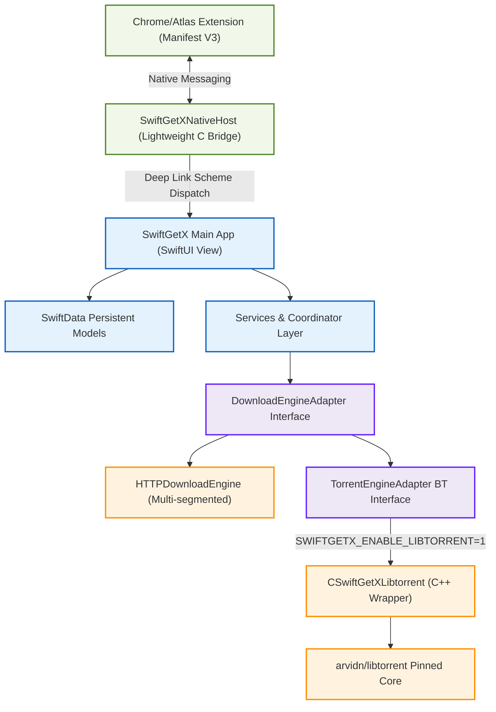

<p align="center">
  <a href="https://github.com/vancehudson/SwiftGetX">
    
  </a>
</p>

<h1 align="center">SwiftGetX</h1>

<p align="center">
  <strong>Lightweight, Premium Native macOS Multi-threaded & BitTorrent Download Manager</strong>
</p>

<p align="center">
  <strong>English</strong> | <a href="README.md">简体中文</a>
</p>

<p align="center">
  <a href="LICENSE"></a>
  
  
  
</p>

<p align="center">
  
  
  
  
</p>


**SwiftGetX** is a lightweight, high-performance native download manager prototype designed for macOS 14+, built entirely using **SwiftUI**, **SwiftData**, and **Swift Package Manager**. It delivers a premium native macOS feel, frictionless browser takeover integration, and a highly pluggable BitTorrent engine abstraction.

---

## ✨ Features

### 🎨 Responsive Liquid Glass UI & Maintenance
*   **macOS Premium Aesthetics**: Sleek three-pane interface conforming to macOS human interface guidelines with full support for Light & Dark mode and polished micro-interactions.
*   **Polished Micro-Interactions**: Real-time inspector view, adjustable toolbar commands, user settings window, and a persistent Menu Bar status tray item.
*   **Dynamic Localization**: Full runtime language switching for System Default, English, and Simplified Chinese (`zh-Hans`). The interface updates instantly without requiring an app relaunch, powered by a customized `AppResources` asset manager for on-demand string and bundle discovery.
*   **Smart Clipboard Capture**: Monitors the clipboard for download links and presents them inside a gorgeous, interactive liquid-glass float banner.
*   **Sparkle Auto-Updates**: Seamless integration of the gold-standard [Sparkle](https://sparkle-project.org) framework. Supports automatic update checks on launch or manual check via menu items. Updates are cryptographically secured using EdDSA (Ed25519) signatures and published automatically through GitHub Actions.

### ⚡ Segmented HTTP/HTTPS Engine
*   **Multi-Segment Parallelism**: Fast multi-threaded segmented downloads with robust HTTP Range-based chunk resume capability, with customizable per-task HTTP options.
*   **Response Metadata Capture**: Automatically detects and records HTTP response metadata (including ETag, Last-Modified, and Server headers), rendering professional diagnostics in the inspector.
*   **Scheduling & Resiliency**: Built-in robust download scheduler with global/queue concurrent task limits, automatic requeue on failure, and customizable retry limits.
*   **Safe Assembly**: Keeps incomplete downloads under a temporary `.part` structure, merging and renaming them instantly upon successful integrity check.

### 🧩 Zero-Configuration Browser Integration
*   **Chrome Takeover (Manifest V3)**: Built-in Chrome extension. When a supported HTTP, HTTPS, magnet, or `.torrent` download is triggered in Chrome, the extension intercept-transports it via Native Messaging to SwiftGetX, cancelling the Chrome item after SwiftGetX accepts. If IPC fails, Chrome resumes the original download instantly.
*   **Multi-Chromium Discovery**: Main App automatically scans local directory trees on startup or focus, auto-detecting extension installations in Google Chrome and OpenAI ChatGPT Atlas. Generates or repairs Native Messaging manifests (`com.swiftgetx.native.json`) instantly with zero manual ID copy-pasting.
*   **Rich Handoff Context**: Securely passes download origins (source page URL, page title, and proposed filename) via deep links (`swiftgetx://download` and `swiftgetx://browser-setup`) with an integrated diagnostic status panel.
*   **Safari Web Extension Template**: Clean Safari Web Extension bundle placeholder, ready for easy Xcode App Extension Target integration with Apple Developer certificate signing.

### 🧬 Dual-Engine BitTorrent Architecture
*   **Decoupled Design**: Features a generic `TorrentEngineAdapter` protocol, isolating BT implementation details completely from SwiftData models and SwiftUI views.
*   **Swift-Native Torrent Module**: A built-in, lightweight pure-Swift BT/DHT engine. Implements custom KRPC UDP search lookup, routing tables, Local Service Discovery (LSD), and Peer Exchange (PEX). Features zero C++ dependencies and compiles instantly.
*   **Pure Swift Protocol Stack**: Custom-built Peer Wire Protocol binary framing engine (enforces maximum length limits to prevent buffer overflow attacks) with full BEP 9 / BEP 10 Magnet Extension support to query metadata directly from peers. Features integrated pure-Swift HTTP/UDP Tracker announcers.
*   **Pluggable Physical BT Engine (libtorrent)**: Vendors a pinned source of `arvidn/libtorrent` v2.0.12 via a static `CSwiftGetXLibtorrent` C++ bridge. Activated dynamically by setting `SWIFTGETX_ENABLE_LIBTORRENT=1` for robust, professional-grade downloading.
*   **Fine-Grained Runtime Control**: Toggle DHT, PEX, and LSD options individually with custom DHT bootstrap routers. Supports real-time upload/download speed limits, sequential download prioritization, concurrent connection and upload slot limits, and seeding ratio enforcement.
*   **Deep Health Snapshot & Diagnostics**: Displays metadata fetching progress, complete Peer lists (up to 100 peers monitored in real time), interactive Tracker tables (add, remove, or force reannounce), DHT routing metrics, and resume-data dirty state tracking.

---

## 📐 Architecture & Repository Layout

SwiftGetX is engineered with explicit unidirectional dependencies and clear module boundaries:



### 📂 Directory Structure

*   `Sources/SwiftGetX/`：Primary macOS App code (SwiftUI layouts, persistences, services, and Chrome/Safari assets).
*   `Sources/SwiftGetXCore/`：Shared communication layer. Contains deep link encoders, IPC frames, and messaging protocols.
*   `Sources/SwiftGetXNativeHost/`：Ultra-light C bridge that reads stdin/stdout from browsers and dispatches deep-link URLs.
*   `Sources/CSwiftGetXLibtorrent/`：C++ adapter wrapper, exposing libtorrent functions via C-compatible symbols to Swift.
*   `Native/CSwiftGetXLibtorrent/`：CMake build workspace for compiling static libtorrent, OpenSSL, and Boost.
*   `Vendor/libtorrent/`：Git submodule targeting upstream `arvidn/libtorrent`.
*   `Tests/SwiftGetXTests/`：Comprehensive test suite (including a local HTTP Range mock server verifying segmented chunk downloads).
*   `Scripts/`：Helper automation scripts (App packager, DMG assembler, manual extension installer, and native compiler).

---

## 📦 Zero-Threshold Installation & Usage (Out-of-the-Box - Download from Release)

If you prefer to run pre-built binaries directly without compiling from source, download the pre-packaged assets from the **Releases** page:

### Step 1: Install the Main Application
1. Head over to the repository's [Releases](https://github.com/vancehudson/SwiftGetX/releases) page and download the latest `SwiftGetX.dmg`.
2. Double-click the downloaded `.dmg` file to mount it, and drag **SwiftGetX** into your **Applications** directory.
3. **⚠️ First-Time Launch Warning (Gatekeeper Bypass)**:
   * Since this is an unnotarized ad-hoc signed open-source prototype app, macOS might block launch on double-click, displaying: *"Cannot be opened because Apple cannot check it for malicious software"* or *"Unverified Developer"*.
   * **Solution**: Open macOS **System Settings -> Privacy & Security**. Scroll to the bottom to find the "Security" section, click **"Open Anyway"**, and enter your Mac passcode to authorize execution.

### Step 2: Install and Bind the Chrome Browser Extension
1. Download the corresponding `SwiftGetX-Chrome.zip` from the Releases page.
2. Extract the `.zip` archive to a permanent directory of your choice that you **won't delete or move** (such as your `Documents` or a dedicated app support folder).
3. Open Google Chrome, navigate to `chrome://extensions` in the URL bar, and press Enter.
4. Enable the **"Developer Mode"** toggle in the top-right corner.
5. Click the **"Load Unpacked"** button in the top-left corner, and select the folder you just extracted.
6. **Activate Automatic Binding**: Launch and focus the SwiftGetX main application once. Upon startup, the app automatically scans your local Chrome extension directory, verifies the SwiftGetX extension ID, and writes the background Native Messaging host manifest config file automatically.
7. **Start Using**: You are good to go! Right-click any downloadable link in Chrome and choose `Download with SwiftGetX`, or trigger a regular download. The extension will intercept the request and hand it over to SwiftGetX for lightning-fast multi-segment downloads.

---

## 🛠️ Requirements

*   **Operating System**: macOS 14 (Sonoma) or newer.
*   **Toolchain**: Swift 6.0 Compiler / Xcode 15+.
*   **Native Torrent Requirements** (only needed when enabling physical libtorrent):
    ```sh
    brew install cmake boost openssl
    ```

---

## 🚀 Quick Start (For Developers compiling from Source)

### One-command Local Build and Test
The repository includes a local development entrypoint. By default, it runs the lightweight build and test suite with the pure-Swift BT engine (mock and fallback setups are the default):

```sh
Scripts/local-build.sh
```

Common options:

```sh
# Build only, without tests
Scripts/local-build.sh --skip-tests

# Release build
Scripts/local-build.sh --release

# Automatically check and install Homebrew dependencies (cmake, boost, openssl)
Scripts/local-build.sh --install-deps

# Build and test with Native libtorrent enabled
Scripts/local-build.sh --native-libtorrent

# Assemble SwiftGetX.app, SwiftGetX.dmg and automatically package the Chrome Extension
Scripts/local-build.sh --release --dmg

# Package only the Chrome extension under dist/chrome/*.crx and *.zip
Scripts/local-build.sh --chrome-extension

# Install the Chrome Native Messaging host after build (with automatic extension discovery)
Scripts/local-build.sh --install-native-host <your-extension-id>
```

### 1. Default Compilation (Swift-Only HTTP Mode)
To build and test the codebase instantly without external dependencies:

```sh
# 1. Compile the app and Native Messaging bridge
swift build

# 2. Run the main SwiftGetX app
swift run SwiftGetX

# 3. Execute the Swift Testing suite
swift test
```

### 2. Complete Compilation (With Native BitTorrent Core)
To compile the C++ libtorrent static bridge:

```sh
# 1. Pull libtorrent's required submodules
git -C Vendor/libtorrent submodule update --init deps/try_signal deps/asio-gnutls

# 2. Compile static libtorrent binary using OpenSSL & Boost
Scripts/build-libtorrent.sh

# 3. Build the app with the libtorrent feature flag enabled
SWIFTGETX_ENABLE_LIBTORRENT=1 swift build

# 4. Run native BT integration tests
SWIFTGETX_ENABLE_LIBTORRENT=1 swift test
```
> [!TIP]
> If your Homebrew binaries are installed in a non-standard location (such as `/usr/local` on Intel Mac), specify your prefix during compilation:
> `SWIFTGETX_HOMEBREW_PREFIX=/usr/local SWIFTGETX_ENABLE_LIBTORRENT=1 swift build`

---

## 🔌 Browser Integration & Handoff Setup

SwiftGetX is built with a smart auto-discovery framework that configures Chrome Native Messaging automatically.

### Chrome / Chromium Setup
1.  **Load the Extension**: Open Chrome, go to `chrome://extensions`, toggle **Developer Mode** on. Click **Load Unpacked**, and select the folder:
    `Sources/SwiftGetX/Resources/ChromeExtension`
2.  **Launch SwiftGetX**: Start or focus the SwiftGetX App. The app automatically scans local Chrome/Atlas preference stores, extracts the unpacked extension ID, and writes a correctly configured native host manifest file to:
    `~/Library/Application Support/Google/Chrome/NativeMessagingHosts/com.swiftgetx.native.json`
3.  **Takeover Downloads**: Right-click any downloadable link in Chrome and click `Download with SwiftGetX`, or trigger a regular download. The extension will automatically capture it and pipe it directly to SwiftGetX.

> [!NOTE]
> **Manual Installation**: You can manually install the manifest for development using:
> ```sh
> Scripts/install-native-host.sh .build/arm64-apple-macosx/debug/SwiftGetXNativeHost <extension-id>
> ```

### Safari Integration
*   Safari Extension assets are located at `Sources/SwiftGetX/Resources/SafariWebExtension`.
*   For signed distribution, you must build and compile a Safari Web Extension target in Xcode, embedding the extension inside the signed macOS App bundle's `Contents/PlugIns` folder.

---

## 📦 Packaging & CI/CD Pipelines

### Local Packaging
Assemble a local ad-hoc signed `.app` or `.dmg` for debugging outside the terminal:

```sh
# Assemble SwiftGetX.app (Debug Mode)
Scripts/package-dmg.sh debug dist

# Compile and package a clean SwiftGetX.dmg (Release Mode, with icons and DMG layouts)
Scripts/package-dmg.sh release dist --dmg
```

### GitHub Actions Workflows
Two automated workflows are supplied in `.github/workflows/`:
*   `build.yml`: Compiles, tests, and builds a downloadable DMG artifact for every branch push or pull request.
*   `release.yml`: Runs when a version tag (`v*`) is pushed. Automatically compiles the release build, signs files, builds the DMG, and drafts a GitHub Release containing the final DMG and extension distribution ZIP/CRX files.

---

## 🧪 Testing

We use Apple's modern **Swift Testing** framework (`@Suite`, `@Test`, and `#expect`):

*   **Test Cases**: Validates color-scheme preferences, clipboard links parser, native messaging framing, chunk planners, name collision resolution, and HTTP range downloads using a local segmented chunk server.
*   Commands: `swift test` (or `SWIFTGETX_ENABLE_LIBTORRENT=1 swift test`).

---

## ⚠️ Compliance & Sandbox Warnings

Before distributing your custom build of SwiftGetX, note these critical macOS platform guidelines:

1.  **Gatekeeper Codesigning & Notarization**:
    *   To prevent Gatekeeper warnings on other machines, you must sign the binaries using an active Apple Developer account's `Developer ID Application` certificate and notarize the output via `xcrun notarytool`.
2.  **App Sandbox Restrictions**:
    *   Sandboxed apps are forbidden from launching arbitrary helper binaries (like `SwiftGetXNativeHost`) unless they share a matching App Group container, or operate in a privileged non-sandboxed environment.
3.  **Secret Management**:
    *   Do not commit private `.pem` browser extension signing keys or Apple App Store API credentials to the Git repository.

---

## 🤝 Contributing

We welcome all contributions! Whether it is fixing micro-bugs, updating responsive UI widgets, or optimizing BT resume states:

1.  Keep indentation at **4 spaces** conforming to idiomatic Swift patterns.
2.  Annotate persistent models or views interacting with SwiftData or observable states with `@MainActor`.
3.  Ensure `swift test` passes locally before opening a pull request.

---

## 📄 License

This project is licensed under the [MIT License](LICENSE). Feel free to use, modify, and distribute it!

---
*Copyright (c) 2026 Vance Hudson. Special thanks to all open-source community members testing and contributing to SwiftGetX.*
