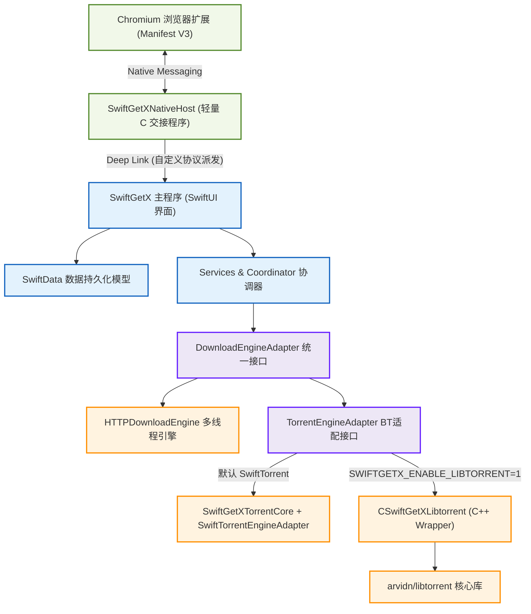

<p align="center">
  <a href="https://github.com/vancehuds/SwiftGetX">
    
  </a>
</p>

<h1 align="center">SwiftGetX</h1>

<p align="center">
  <strong>macOS 原生轻量、高颜值的多线程与 BT 下载管理器</strong>
</p>

<p align="center">
  <a href="README.en.md">English</a> | <strong>简体中文</strong>
</p>

<p align="center">
  <a href="LICENSE"></a>
  
  
  
</p>

<p align="center">
  
  
  
  
</p>


**SwiftGetX** 是一个面向 macOS 14+ 的轻量原生下载管理器原型，采用 **SwiftUI**、**SwiftData** 和 **Swift Package Manager** 构建。项目目标是在保持轻量原生体验的同时，提供 HTTP/HTTPS 下载、浏览器显式交接、剪贴板链接捕获，以及默认纯 Swift 的 BT 下载能力。


---

## ✨ 核心特性

### 🎨 现代原生 UI & 维护
*   **液态玻璃设计**：采用符合 macOS 设计规范的三栏式交互界面，支持深色模式与精致的微交互。
*   **交互细节**：包含任务列表、右侧属性检查器、工具栏、偏好设置窗口及常驻系统菜单栏（Menu Bar）图标。
*   **多语言动态本地化**：支持系统默认、英文、简体中文的运行时动态切换。切换时 UI 即时刷新，无需重启 App，配合自主研发的 `AppResources` 实现资源与本地化文件的智能发现与按需加载。
*   **智能剪贴板**：自动检测剪贴板链接，并在主界面弹出流线型玻璃拟态的下载建议条。
*   **Sparkle 自动更新**：集成 macOS 黄金标准 [Sparkle](https://sparkle-project.org) 框架，支持启动时自动检查更新及菜单栏“检查更新…”手动触发。更新包基于 EdDSA (Ed25519) 密钥签名验证完整性，配合 GitHub Actions 自动化流水线签名并分发 `appcast.xml`。

### ⚡ 模块化 HTTP/HTTPS 下载引擎
*   **多线程分段**：支持高性能多线程多分段下载，支持 Range 断点续传，支持为每个任务指定个性化的 HTTP 下载选项。
*   **响应元数据保存**：自动探测并记录服务器的 HTTP 响应元数据（如 ETag、Last-Modified、Server 报头等），提供专业的网络诊断视轨。
*   **调度策略与恢复**：内置强健的任务调度队列协调器，支持全局/队列并发限制、下载失败后自动重新排队、以及自定义的重试策略和次数上限。
*   **安全性**：使用临时 `.part` 文件存储未完成的下载，校验成功后无缝重命名。

### 🧩 零配置浏览器深度集成
*   **Chrome 下载接管**：内置 Chrome 扩展（Manifest V3），默认开启“下载接管”。当在 Chrome 中触发符合规则的下载任务时，扩展将任务透明接管，并通过 Native Messaging 协议派发给 SwiftGetX，随后自动取消 Chrome 原生下载任务。如果交接失败，Chrome 将无缝继续下载。
*   **多 Chromium 浏览器发现**：App 内置智能宿主扫描器，会在启动或激活时**自动发现**本地 Chrome、Chrome Canary、Edge、Brave、Vivaldi、Arc、Chromium 以及 Atlas 的 Extension 配置文件，自动探测 Extension ID 并一键修复本地 Native Messaging 宿主清单（`com.swiftgetx.native.json`），用户无需任何手动配置。
*   **完整上下文传递**：交接时智能捕获并携带浏览器下载上下文（包括来源页面 URL、标题、建议的文件名等），并通过安全的自定义协议 `swiftgetx://download` 与 `swiftgetx://browser-setup` 进行派发，同时支持在偏好设置中一键开启诊断面板。
*   **Safari 功能等效扩展**：内置 Safari Web Extension 资源，覆盖右键菜单、弹窗发送、选区发送、页面下载链接扫描、连接诊断和下载接管开关；正式分发时仍需在 Xcode 中配置 Safari App Extension Target 并走苹果签名链。

### 🧬 双引擎 BitTorrent 下载架构
*   **隔离设计**：定义了高度抽象的 `TorrentEngineAdapter` 接口协议，将 BT 引擎的具体实现与主 App 彻底隔离。
*   **Swift 原生极速 BT 模块**：内置纯 Swift 编写的极速 BT/DHT 功能。自主实现了基于 KRPC 的 UDP 磁力链接寻址、DHT 路由表管理、LSD 本地服务发现及 PEX 节点交换，零 C++ 依赖极速启动并探测 Peer。
*   **协议栈纯 Swift 实现**：自主开发了 Peer Wire Protocol 原生二进制协议栈（具备最大数据帧长限制以防内存溢出攻击），并完美实现 BEP 9 / BEP 10 磁力链接扩展协议，支持直接与 Peer 进行 Metadata 元数据交换，实现“无种子”情况下的快速磁力解析。同时内置了纯 Swift 编写的 UDP 与 HTTP Tracker 客户端，实现主动 Tracker 公告宣告。
*   **可选参考 BT 引擎 (libtorrent)**：仓库内置了 `arvidn/libtorrent` v2.0.12 源码包，并通过 `CSwiftGetXLibtorrent` 提供 C++ 封装。默认发行与日常构建使用纯 SwiftTorrent 路径；只有设置 `SWIFTGETX_ENABLE_LIBTORRENT=1` 时才会启用可选 libtorrent 参考实现。
*   **精细化运行时控制**：支持一键开关 DHT, PEX, LSD 协议，支持自定义引导路由节点。提供每秒上传/下载限速、顺序下载模式、最大连接数/上传槽限制、种子分享率限速等运行时配置。
*   **深度健康快照与监控**：实时呈现涵盖 Metadata 获取状态、已连接/正在连接 Peer 列表（最高支持 100 个 Peer 监视）、Tracker 详细列表（支持重新公告、手动增删）、DHT 节点数及 resume 数据脏状态的全面健康快照。


---

## 📐 项目架构与目录结构

SwiftGetX 的模块边界清晰、依赖单向：



### 📂 目录说明

*   `Sources/SwiftGetX/`：主 macOS 应用程序源码（UI、持久化服务、核心业务逻辑与 bundled 浏览器扩展资源）。
*   `Sources/SwiftGetXCore/`：共享协议模块。包含浏览器通讯协议、Deep Link 模型和 Native Messaging 的消息 Framing。
*   `Sources/SwiftGetXNativeHost/`：轻量级 C 语言浏览器交接进程，读取 Chrome Standard I/O 并派发 Deep Link。
*   `Sources/CSwiftGetXLibtorrent/`：C++ Bridge 封装。使得 Swift 可以直接通过 C-API 操纵 libtorrent。
*   `Native/CSwiftGetXLibtorrent/`：CMake 构建配置，用于自动化编译 libtorrent 静态库及其依赖。
*   `Vendor/libtorrent/`：采用 Git 子模块锁定的 upstream `arvidn/libtorrent` 源码。
*   `Tests/SwiftGetXTests/`：完整的单元和集成测试用例，内含本地分段 HTTP Mock Range 测试服务器。
*   `Scripts/`：辅助脚本（包括打包、安装 native-host 辅助脚本、libtorrent 编译脚本）。

---

## 📦 零门槛安装与使用教程 (开箱即用 - 从 Release 下载)

如果您不想本地编译代码，而是想直接从本仓库的 **Releases** 页面下载打包好的成品使用，请按照以下步骤操作：

### 第一步：安装主程序
1. 前往本仓库的 [Releases](https://github.com/vancehuds/SwiftGetX/releases) 页面下载最新版的 `SwiftGetX.dmg`。
2. 双击打开 `.dmg` 挂载卷，将 **SwiftGetX** 拖入您的 **Applications (应用程序)** 文件夹中。
3. **首次启动安全提示**：
   * 如果仓库配置了 Developer ID release secrets，官方 tag release workflow 会执行签名、公证和 stapling 校验；如果没有付费 Apple Developer 账号或下载的是本地构建、fork 产物，macOS 仍可能提示：*“无法打开，因为 Apple 无法检查其是否包含恶意软件”* 或 *“来自未验证的开发者”*。
   * **解决方法**：请打开 macOS 的 **系统设置 -> 隐私与安全**，拉到页面最下方找到“安全性”一栏，点击 **“仍要打开” (Open Anyway)**，并输入您的 Mac 开机密码进行授权，之后即可正常启动应用。

### 第二步：安装并绑定 Chrome 浏览器扩展
1. 在 Releases 页面下载对应的 `SwiftGetX-Chrome.zip`。
2. 将该 `.zip` 压缩包解压到一个您**不会删除或移动**的固定目录（例如您的 `Documents` 或专门存放软件的目录）。
3. 打开 Chrome 浏览器，在地址栏输入 `chrome://extensions` 并回车。
4. 开启右上角的 **“开发者模式” (Developer Mode)** 开关。
5. 点击左上角的 **“加载已解压的扩展程序” (Load Unpacked)** 按钮，选择您刚刚解压出的文件夹目录加载扩展。
6. **激活自动绑定**：运行并激活一次 SwiftGetX 主程序。App 启动后会自动检测您本地已加载的 Chrome 扩展 ID，并自动在系统后台写入 Native Messaging 清单配置文件，完成完美对接！
7. **使用方法**：此时，在 Chrome 中右键点击任何可下载的链接或触发常规文件下载，扩展便会自动拦截，交接给 SwiftGetX 进行高性能多线程分段极速下载。

---

## 🛠️ 环境要求

*   **运行系统**：macOS 14 (Sonoma) 或更高版本。
*   **编译环境**：Swift 6.0 Toolchain / Xcode 15+。
*   **可选 libtorrent 参考实现依赖**（普通构建/发行不需要，仅在启用 `SWIFTGETX_ENABLE_LIBTORRENT=1` 时需要）：
    ```sh
    brew install cmake boost openssl
    ```

---

## 🚀 快速上手 (Quick Start - 面向开发者本地编译)

### 一键本地编译与测试
仓库提供了本地开发入口脚本，默认执行轻量构建并运行测试（默认使用轻量 Swift 原生 BT 引擎，适合日常快速验证）：

```sh
Scripts/local-build.sh
```

常用参数：

```sh
# 只编译，不跑测试
Scripts/local-build.sh --skip-tests

# Release 构建
Scripts/local-build.sh --release

# 一键安装可选 native libtorrent 参考实现依赖（cmake boost openssl）
Scripts/local-build.sh --install-deps

# 启用重量级 Native libtorrent 引擎后构建并测试
Scripts/local-build.sh --native-libtorrent

# 组装 SwiftGetX.app、SwiftGetX.dmg 并自动打包 Chrome 扩展
Scripts/local-build.sh --release --dmg

# 仅打包 Chrome 扩展生成 dist/chrome/*.crx 和 *.zip 资源
Scripts/local-build.sh --chrome-extension

# 构建后安装 Chrome Native Messaging Host（可省略 ID 自动发现）
Scripts/local-build.sh --install-native-host <your-extension-id>
```

### 1. 基础构建（默认 SwiftTorrent）
SwiftGetX 默认采用纯 SwiftTorrent 引擎，此时**完全不需要**下载复杂的 C++ 依赖：

```sh
# 1. 编译主 App 与 Native Host
swift build

# 2. 运行主应用程序
swift run SwiftGetX

# 3. 运行 Swift Testing 自动化测试
swift test
```

### 2. 进阶构建（启用可选 native libtorrent 参考实现）
要启用可选的 libtorrent 对照/参考实现，需要编译内置的 `libtorrent` C++ 封装：

```sh
# 1. 自动拉取 libtorrent 依赖的子模块
git -C Vendor/libtorrent submodule update --init deps/try_signal deps/asio-gnutls

# 2. 编译 libtorrent 静态库 (使用 Boost & OpenSSL)
Scripts/build-libtorrent.sh

# 3. 设定环境变量开启 BT 适配器并编译
SWIFTGETX_ENABLE_LIBTORRENT=1 swift build

# 4. 运行 BT 功能测试
SWIFTGETX_ENABLE_LIBTORRENT=1 swift test
```
> [!TIP]
> 如果你的 Homebrew 安装在自定义路径（如 Intel 芯片的 `/usr/local` ），请在编译前设定 `SWIFTGETX_HOMEBREW_PREFIX` 环境变量：
> `SWIFTGETX_HOMEBREW_PREFIX=/usr/local SWIFTGETX_ENABLE_LIBTORRENT=1 swift build`

---

## 🔌 浏览器交接与扩展集成

SwiftGetX 设计了一套精妙的**主动发现与自动自我修复机制**。

### Chrome / Chromium 浏览器设置
1.  **加载扩展**：打开 Chrome，访问 `chrome://extensions`，开启右上角的 **开发者模式**。点击 **加载已解压的扩展程序**，选择目录：
    `Sources/SwiftGetX/Resources/ChromeExtension`
2.  **自动绑定**：运行并激活一次 SwiftGetX 主 App。主 App 将会自动扫描已支持的 Chromium 浏览器配置（Chrome、Chrome Canary、Edge、Brave、Vivaldi、Arc、Chromium、Atlas），识别到 SwiftGetX 扩展的本地 Extension ID 后，会自动写入对应浏览器的 `NativeMessagingHosts/com.swiftgetx.native.json` 清单配置文件。
3.  **开始接管**：在 Chrome 浏览器中随意右击一个下载链接，即可在右键菜单中看到 `使用 SwiftGetX 下载`；或者直接点击下载常规文件，扩展便会自动拦截，派送至 SwiftGetX 进行多线程极速下载！

> [!NOTE]
> **本地调试工具**：你也可以在开发期间手动注册 Native Host：
> ```sh
> Scripts/install-native-host.sh .build/arm64-apple-macosx/debug/SwiftGetXNativeHost <your-extension-id>
> ```

### Safari 浏览器集成
*   Safari 扩展资源位于 `Sources/SwiftGetX/Resources/SafariWebExtension`。
*   Safari 扩展功能与 Chrome 扩展保持一致：可通过右键菜单或弹窗发送当前页面、链接、媒体、选中文本，也可扫描页面候选下载链接，并在 Native Messaging 可用时接管 Safari 下载。
*   显式发送优先走 Native Messaging；如果宿主不可用，扩展会退回到 `swiftgetx://download` 深度链接，确保用户发起的交接仍可进入 SwiftGetX。下载接管路径只有在 SwiftGetX 确认接收后才取消浏览器原生下载。
*   在正式发行版中，需由开发者在 Xcode 内将此目录配置为 Safari Extension Target，签名后打包嵌入主 `.app` 的 `Contents/PlugIns` 目录中。

---

## 📦 本地打包与 CI/CD

### 本地打包 Ad-hoc App
项目提供了一键打包和 Ad-hoc 签名脚本，方便直接打包出可脱离控制台运行的 `.app` 和 `.dmg`：

```sh
# 组装 SwiftGetX.app (Debug 版)
Scripts/package-dmg.sh debug dist

# 组装并打包出 SwiftGetX.dmg (Release 版，包含资源、图标并生成 Ad-hoc 签名)
Scripts/package-dmg.sh release dist --dmg
```

### GitHub Actions CI
项目在 `.github/workflows/` 下预置了全自动的流水线：
*   `build.yml`：每次触发 PR 或 Push 时自动在 `macos-15` 容器中编译、测试并生成可供下载的 DMG。
*   `release.yml`：当你向 GitHub 推送以 `v*` 开头的版本 Tag 时，自动编译、封包并自动创建 Release、上传安装 DMG 和 Chrome 扩展 ZIP/CRX 安装包。

---

## 🧪 自动化测试 (Testing)

测试是 SwiftGetX 品质的基石，我们使用 Swift 官方全新的 **Swift Testing** 框架构建测试组：

*   **测试覆盖范围**：深色模式适配器、链接捕获过滤、Native Messaging 报文封包/解包（Framing）、多段下载调度器（Segment Planner）、重复文件名冲突重命名算法，以及真实的本地分段 HTTP 断点续传正确性测试。
*   测试命令：`swift test` 或开启 BT 引擎测试 `SWIFTGETX_ENABLE_LIBTORRENT=1 swift test`。

---

## ⚠️ 开源合规与发布安全注意事项

如果你准备打包发布或者向外界推广你的 SwiftGetX 衍生版本，请注意以下安全与规范要求：

1.  **沙盒与公证 (Sandboxing & Notarization)**：
    *   根据 macOS 的 Gatekeeper 机制，为避免出现“应用已损坏”的警告，推荐使用苹果开发者账号的 `Developer ID Application` 证书进行签名，并通过 `xcrun notarytool` 提交给苹果完成公证。没有付费账号时仍可发布未公证 DMG，但用户首次打开时通常需要手动允许。
    *   由于 Native Messaging 机制需要启动辅助子进程 `SwiftGetXNativeHost`，如果 App 运行在严苛沙盒（App Sandbox）中，请确保辅助进程已注册并在宿主 App 的 App Group 内，或在非沙盒模式下发布。
2.  **不要将机密提交至仓库**：
    *   绝不要向 Git 提交本地调试生成的 `.pem` 密钥文件。
    *   不要提交任何苹果开发者的 `api_key` 配置文件或 Keychain 密码。

---

## 🤝 参与贡献

我们欢迎任何形式的贡献，无论是反馈 Bug、改进 UI，还是改进 SwiftTorrent 行为！

1.  请确保代码保持 **4 空格缩进**，遵守 idiomatic Swift 风格。
2.  对所有状态、SwiftData 或持久层变更，标注 `@MainActor` 以防止并发数据隔离碰撞。
3.  提交 Pull Request 之前，务必确保 `swift test` 本地通过。

---

## 📄 开源许可证

本项目基于 [MIT 许可证](LICENSE) 开源。欢迎大家自由提取、改造或分发！

---
*版权所有 (c) 2026 Vance Hudson。感谢所有参与测试与使用本项目的开源社区成员。*
